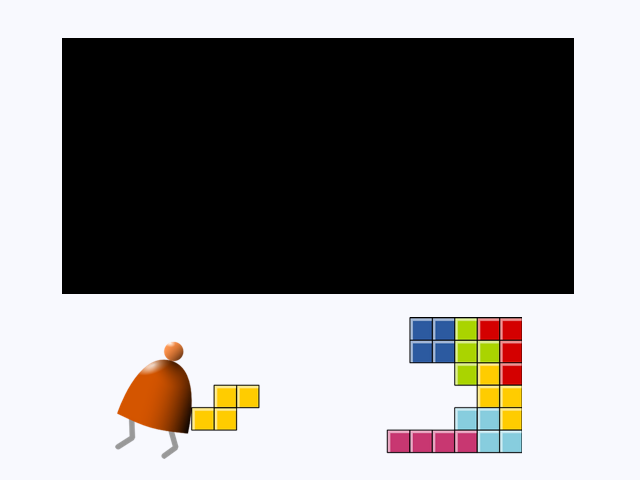

# Nand2Tetris4FPGA

Documentação para rodar o projeto Nand to Tetris em FPGAs da Altera

 

## Acesso ao ambiente remoto

Salve sua chave privada na pasta `.ssh` e altere sua permissão para `600`. Crie um arquivo `.ssh/config` com o seguinte conteúdo:
```
Host vlab
  HostName vlab.dc.ufscar.br
  Port 2002
  User <USER>
  IdentityFile ~/.ssh/<USER>.pem
```
Digite `ssh vlab` para acessar o terminal remoto ou use o extensão [Remote - SSH](https://marketplace.visualstudio.com/items?itemName=ms-vscode-remote.remote-ssh) no VS Code.

## Usando um `Makefile` no Quartus II

Vamos usar um único [`Makefile`](./Makefile) para gerar o hardware e compilar o software de cada projeto. Para que ele funcione corretamente, vamos seguir alguns padrões de projeto:

1. Os arquivos Verilog e de conteúdo de memória devem estar na subpasta `rtl`.
1. Os arquivos de software a serem compilados, montados, etc. devem estar na subpasta `src`.

Veja um exemplo a seguir:

```
.
├── 01_johnson (pasta do projeto)
│   ├── rtl
│   │   └── top.sv
│   └── src
│       └── main.hack
├── DE10_standard.qsf (arquivo de pinos da placa)
├── Makefile
└── README.md (este arquivo)
```
Como o Makefile fica na pasta anterior, os comandos para usá-lo devem ser sempre `make -f ../Makefile` dentro das pastas dos projetos quando quiser usar o Quartus II.

Se deseja usar o `iverilog` para simular o projeto, entre na pasta `rtl` e use `make -f ../../Makefile sim`. 

## Memória RAM e I/O mapeado em memória

A memória RAM do sistema é composta pelas seguintes partes, todas elas com 16 bits cada:

    0x0000-0x3FFF: RAM       (16K words = 32KB)
    0x4000-0x5FFF: Screen     (8k words = 16KB)
    0x6000       : Keyboard   (single register)

O computador possui uma memória ROM de 32K words (64KB) para armazenar os programas (Harvard).

## Sinal VGA e formatos de imagens

Para converter uma imagem em um formato mais simples de ser interpretado, vamos usar o comando `convert` do pacote [ImageMagick®](https://imagemagick.org/index.php). 

    % convert Nand2Tetris.png -compress none  Nand2Tetris.ppm